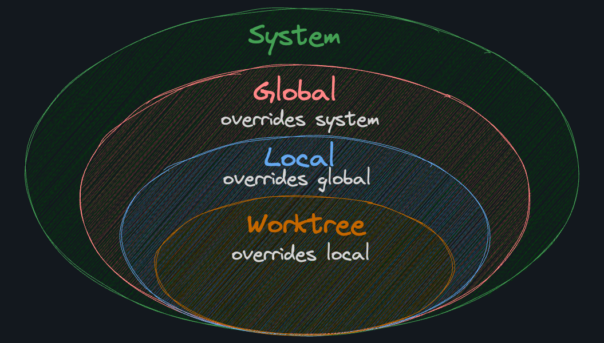
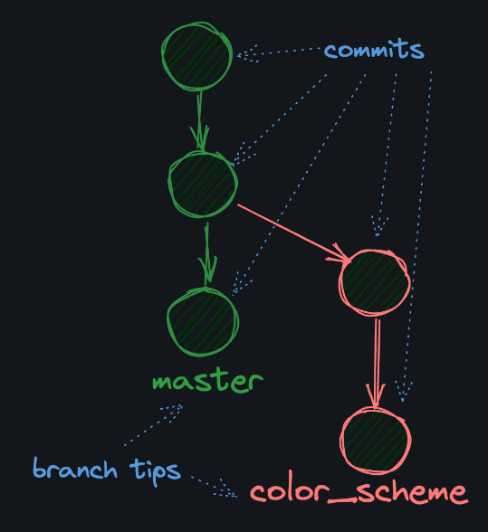
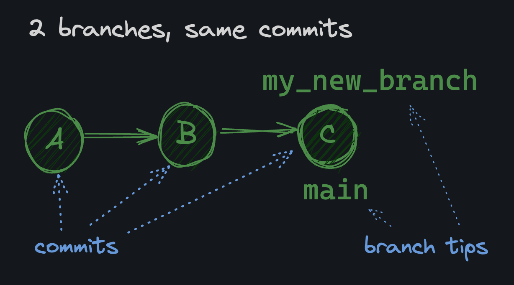
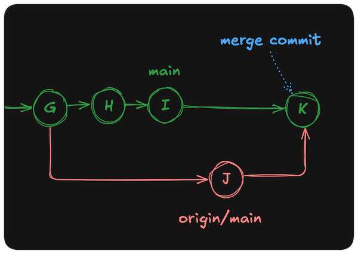

# Curso-Git

## Git

O Git é um sistema de controle de versionamento utilizado para gerenciamento de código utilizado para a manutenção de um histórico de mudanças no ciclo de vida do código. Com a utilização e registro de alterações por meio do Git é possível realizar diferentes ações como reverter situações de erro em um código, maior colaboração em uma equipe de desenvolvedores e realizar backups de um projeto.

## Instalação

A instalação do Git é realizado por meio de linha de comando, dependendo do sistema operacional.

### Windows (WSL) / Linux (Ubuntu)

```bash
sudo apt install git-all
```

### macos

```bash
brew install git
```

Para verificar se o Git foi instalado:

```bash
git --version
```

## Sitaxe de comando

Os comandos no Git recebem diferentes argumentos da seguinte forma:

```bash
comando < obrigatório > [ opcional ]
```

Por exemplo o comando de criação de diretório:

```bash
mkdir <directory-name>
```

## Documentação

Para acessar o manual do Git, execute o comando:

```bash
man git
```

## Classificação comandos

No Git, os comandos são diivididos em comandos de alto nível e baixo nível.

### Comandos de alto nível

- git status
- git add
- git commit
- git push
- git pull
- git log

### Comandos de baixo nível

- git apply
- git commit-tree
- git hash-object

## Atribuição

Para que seja possível rastrear quem fez alguma alteração é necessário primeiro definir as suas informações. As informações necessárias são o nome de usuário e o email e podem ser registradas com os seguintes comandos:

```bash
git config --add --global user.name "username"
git config --add --global user.email "email@example.com"
```

**git config:** comando para realizar a interação com a configuração do Git

**--add:** definição da ação desejada

**--global:** define que a configuração seja armazenada globalmente

**user:** a seção

**name:** a chave da seção

**username:** o valor definido para a chave

Para obter as informações registradas, execute o seguinte comando:

```bash
git config --get user.name
git config --get user.email
```

Para listar todas as configurações realizadas utiliza-se o comando:

```bash
git config --list
git config --list --local
git config --list --global
```

Para visualizar um único valor de uma configuração utiliza-se:

```bash
git config --get <key>
```

Para remover um valor de configuração utiliza-se o comando:

```bash
git config --unset <key>
```

Para remover todas as instâncias de uma key da configuração utiliza-se:

```bash
git config --unset-all example.key
```

Caso necessário, pode ser deletado uma seção inteira da configuração:

```bash
git config --remove-section section
```

### Localização

Existe diferentes locais para a configuração do Git, de forma mais geral ou especializada.

**- system:/etc/gitconfig** para configurar Git para todos os usuários no sistema.

**- global:~/.gitconfig** para configurar Git para todos os projetos de um usuário.

**- local:.git/config** para configurar Git em um projeto.

**- worktree:.git/config.worktree** para configurar Git em um trecho de projeto.


## Repositório

A primeira etapa na realização de um projeto e a criação de um repositório, onde cada repositório normalmente armazena um projeto. O repositório é acompanhado por um **.git** com todas as informações responsáveis por rastreamento e versionamento do projeto.

### Criação

Para a criação de um repositório primeiro é necessário a criação de um diretório:

```bash
mkdir <nome>
cd <nome>
```

E em seguida criar um novo repositório Git:

```bash
git init
```
#### Remoto

Para adicionar um repositório remoto:

```bash
git remote add <name> <uri>
```

### Fetch

Para trazer informações do remoto para o local:

```bash
git fetch
```

**NÃO RETORNA OS COMMITS**

### Status

Um arquio em um repositório pode estar em diferentes estados como os seguintes:

- untracked: não sendo rastreado pelo Git
- staged: marcado para inclusão no próximo commit
- committed: salvo no histórico do repositório

O comando **git status** apresenta o estado atual do repositório e de todos os seus arquivos.

```bash
git status
```

### Add

O comando **git add** é responsável por definir quais arquivos estarão sendo adicionado em um
commit:

```bash
git add <arquivo>
```

### Commit

Depois de definir os arquivos é possível realizar o commit. O commit é uma forma de salvar o estado atual de um repositório e rastrear alterações no projeto. Um commit é marcado por uma mensagem que descreve as mudanças realizadas no commit.


```bash
git commit -m "message"
```

### Push

O comando push manda as mudanças locais para o remoto:

```bash
git push origin main
```

### Pull

O comando pull é utilizado para retornar as mudanças nos arquivos do repositório remoto:

```bash
git pull [<remote>/<branch>]
```

### Pull Request

Um pull request é uma maneira de propor alterações, permitindo a visualização das mudanças pelos colaboradores antes de ser realizado um merge para a main.

### Reset Soft

O comando reset é utilizado para desfazer as ações do último commit e mudanças realizadas.

O soft é útil quando é desejado retornar para um commit prévio porém mantendo as alterações realizadas prontas para serem definidas.
```bash
git reset --soft <hash>
```

### Reset Hard

Para retornar para um commit e deletar todas mudanças realizadas

```bash
git reset --hard <hash>
```

### Git Log

O comando **git log** apresenta o histórico de commits em um repositório onde é possível visualizar:

- Quem realizou o commit
- Quando o commit foi realizado
- As alterações realizadas

```bash
git log
```

Caso necessário pode ser limitado o número de commits apresentados:

```bash
git --no-pager log -n 10
```

Cada hash gerado para os commits são quase sempre únicos e gerados automaticamente na realização de um commit.

Para mudar a visualização dos logs você pode utilizar o **--decorate**:

```bash
git log --decorate={}
```

- short (normal)
- full (mostra o nome completo da ref)
- no (sem informação)

Para uma visão mais compacta pode ser utilizado o **--oneline**

```bash
git log --oneline
```

```bash
git log --oneline --decorate --graph --parents
```

### Cat-File

O comando **cat-file** é utilizado para a visualização do conteúdo de um commit por meio de sua hash.

```bash
git cat-file -p <hash>
```

## Branch

Uma Branch permite manter a rastreabilidade de diferentes mudanças separadamente. Um projeto pode necessitar de uma mudança em certo aspecto, então uma branch pode ser criada que reflete a implementação da alteração realizada juntamente com seus commmits sem interferir na branch principal.



### Renomear branch

Para renomear uma branch:

```bash
git branch -m oldname newname
```
### Criar branch

Para criar uma nova branch:

```bash
git branch my_new_branch
```

Para criar uma nova branch e mudar após sua criação:

```bash
git switch -c my_new_branch
```

É possível criar uma nova branch com base em um commit:

```bash
git switch -c my_new_branch <hash>
```



Após criar uma nova branch ela utiliza dos commits anteriores da branch base para utilização na nova branch.

### Deletar branch

```bash
git branch -d <branch>
```

### Mudar branch

Para mudar de branch:

```bash
git switch <branch>
git checkout <branch>
```

### Merge

Um merge é a união de duas branches com base em uma branch principal com base nos commits realizados.

```bash
git merge <branch>
```



### Rebase

O rebase funciona de maneira semelhante ao merge porém ele mantem os commits da união das branchs não criando um novo commit como no merge.

```text
A - B - C         main
         \
          D - E   feature_branch
```


## Repositório GitHub

O GitHub é um website de hospedagem repositórios remotos para sere utilizados como backup, compartilhamento, colaboração e portfólio público.

## Gitignore

O arquivo gitignore define quais arquivos devem ser ignorados quando utiliza-se o Git em um diretório e não devem ser rastreadas. Podem estar localizados em diferentes níveis de um diretório.